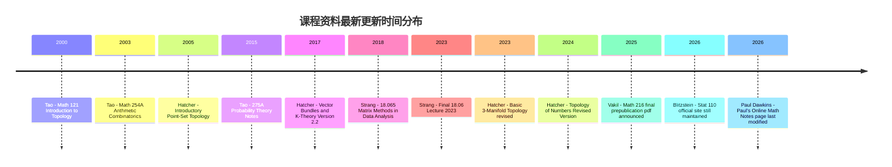

# 数学教师课程资料深度检索报告

## 执行摘要

本报告按"**教师—课程—资源包**"的粒度，筛选并整理了 **6 位具有代表性的数学教师/课程负责人**，覆盖 **线性代数、微分方程、机器学习中的矩阵方法、概率统计、拓扑、代数几何、算术组合、基础分析/微积分衔接** 等方向。之所以选这 6 位，是因为他们在**学校官网、课程主页、MIT OCW、Harvard 官方课程站、Cornell 官方主页、Stanford 官方主页**等一手来源上，留下了**可长期访问、带明确教师归属、资料类型较全**的公开资源。就"公开可获取"的课程包而言，本次共归档了约 **19 个课程/资料包**，其中 MIT OCW 体系最完整，Harvard Stat 110 的练习与解答组织最好，Allen Hatcher 的拓扑资料最适合"教材+讲义"型长期自学，Ravi Vakil 的代数几何资料则是研究生入门到进阶的高强度体系化资源。

结论上，如果你的目标是**尽可能完整地抓取公开教学资料**，最值得优先下载的四套"核心包"是：**Gilbert Strang 的 18.06 Linear Algebra**（视频、作业、解答、考试、整课下载齐全）、**Joe Blitzstein 的 Stat 110**（教材、手册、分主题练习与答案、YouTube、edX 一体化）、**Allen Hatcher 的 Algebraic Topology + Point-Set Topology**（免费 PDF 教材/讲义、修订历史清晰）、以及 **Ravi Vakil 的 Math 216 / The Rising Sea**（课程页、超长讲义、作业结构、近年持续更新）。这四套中，MIT OCW 明确采用 **CC BY-NC-SA 4.0**，最利于教学再利用；其余大多属于**默认保留版权但允许免费下载/个人非商业使用**，需要按原站条款使用。

需要说明的是：用户希望覆盖到"高中数学"，但在"**公开、带教师署名、可稳定索引、且资源包完整**"这一严格标准下，**大学层级的官方教师课程档案明显多于高中层级**。因此本报告主表以内嵌教师署名且资料体系完整的大学资源为主；唯一向高中—大学衔接延伸的教师型资源，是 Paul Dawkins 的 **Algebra / Algebra & Trig Review / Calculus I** 链路，它更适合作为高三竞赛后或大学先修桥接资料。Paul 的站点 2026 年仍在维护，且站内明确给出使用条件。

另记一项与交付形式相关的背景：用户上传的《宇宙学 Heidelberg University》资料索引，显示其偏好"按课程整编、尽量给出直接获取入口"的深度资源清单风格；该文件与本次数学主题无直接内容重合，因此仅作为**交付粒度参考**，未并入数学资源正文。

## 检索范围与方法

本次检索采用"**官方优先、原始页面优先、公开可访问优先**"三层筛选原则。优先级依次为：**学校官网/课程主页 → 出版社或作者主页 → MIT OCW / Harvard 官方课程站 / Stanford 课程博客 → 原始 PDF/官方视频页**。对于存在公开 PDF 但无明确开放许可的资源，报告以"**默认版权保留，允许访问/下载，但不得推断开放改编许可**"处理；对于 MIT OCW 这类明确给出许可的资源，则直接标明许可条款。

"**全部教学资料**"在本报告中的操作性定义是：**教师主页或官方课程页上当前仍可公开访问的全部课程资料入口**，包括但不限于课程说明、教学大纲、日历/进度表、教材、讲义、习题、作业、题解、考试、视频、下载课程包、参考阅读、课程博客档案、公开讲座或配套书页。若课程存在校内 LMS（如 UCLA BruinLearn）但需登录，本报告会注明"存在但不公开"，而不会臆造下载链接。

质量评分采用 **10 分制**，由五项构成：**权威性 4 分、完整性 2 分、可下载性 1.5 分、更新性 1 分、教学可用性 1.5 分**。其中，官方课程页+整课下载+题解/考试齐全的 OCW 类课程通常在 9 分以上；只有单本书或单组讲义、无作业无考试的资源通常在 7.5–8.5 分之间；若资源虽优秀但只提供在线阅读、不便批量整理，则会在"可下载性"上扣分。这个评分是本报告的分析结论，不是原站官方评级。

## 教师详表

### Gilbert Strang

Gilbert Strang 的公开教学资源具有两个显著优势：第一，**MIT OCW 课程包结构完整**，含 syllabus、calendar、video、assignments、solutions、exams、download course；第二，他自己的 **MIT 数学系主页**又把课本、2021 讲义、新版线代教材与数据学习教材串成了一条自学路径。因此如果你的目标是做"本科基础数学 + 应用线性代数"的可离线资料库，Strang 几乎是优先级最高的一位。

| 课程名 | 资源类型 | 标题/描述 | 链接 | 来源 | 许可 | 语言 | 更新时间 | 质量评分 | 适用水平 | 难度 |
|---|---|---|---|---|---|---|---|---|---|---|
| 18.06 Linear Algebra | 课程总入口 | 含 Syllabus、Calendar、Instructor Insights、Video Lectures、Assignments、Exams、Study Materials、整课下载 | `https://ocw.mit.edu/courses/18-06-linear-algebra-spring-2010/` | MIT OpenCourseWare | CC BY-NC-SA 4.0 | 英语 | 课程页 Spring 2010；另含 "Final 18.06 Lecture 2023" | 9.8/10：官方、完整、可整课下载 | 本科低年级、工科基础 | 入门—中级 |
| 18.06 配套讲义 | 讲义/教材 | **Lecture Notes for Linear Algebra (2021)**；含目录、导言、书目、样章，并回链到 OCW 视频与教材 | `https://math.mit.edu/~gs/LectureNotes/` | MIT Math 主页 | 默认版权保留；站点公开阅读/下载 | 英语 | 2021 | 9.2/10：体系化极强，适合自学与备课 | 本科低年级—高年级 | 中级 |
| 18.065 Matrix Methods in Data Analysis, Signal Processing, and Machine Learning | 课程总入口 | 含 Syllabus、Calendar、Readings、Video Lectures、Assignments、Final Project、整课下载 | `https://ocw.mit.edu/courses/18-065-matrix-methods-in-data-analysis-signal-processing-and-machine-learning-spring-2018/` | MIT OCW | CC BY-NC-SA 4.0 | 英语 | Spring 2018；官网页脚 2026 | 9.5/10：应用导向强，视频+作业+项目全 | 本科高年级、AI/数据方向 | 中级—高级 |
| Linear Algebra and Learning from Data | 教材/题解 | 2019 教材页，含目录、前言、书评、参考文献、精选章节、**2023 题末题解** | `https://math.mit.edu/~gs/learningfromdata/` | MIT Math 主页 | 默认版权保留 | 英语 | 2019；题解更新至 2023-11 | 9.0/10：最适合把线代接到 ML | 本科高年级、硕士先修 | 中级—高级 |
| Differential Equations and Linear Algebra | 书页/短视频 | 书页含目录、样章；并外链 **55 个短视频** 与 MIT/MathWorks 视频系列 | `http://math.mit.edu/~gs/dela/` | MIT Math 主页 | 默认版权保留 | 英语 | 书页长期维护；视频系列见 2015 课程页 | 8.8/10：非常适合"线代 + ODE"一体化教学 | 本科低年级—高年级 | 中级 |
| RES.18-009 Learn Differential Equations | 视频课程 | 含 Video Series Overview、分主题视频（First/Second Order、Numerical Methods、Eigenvalues、Fourier/Laplace 等）、整课下载 | `https://ocw.mit.edu/courses/res-18-009-learn-differential-equations-up-close-with-gilbert-strang-and-cleve-moler-fall-2015/` | MIT OCW | CC BY-NC-SA 4.0 | 英语 | Fall 2015；OCW 页 2026 仍在线 | 9.1/10：视频解释力强，适合翻转课堂 | 本科基础—工程应用 | 中级 |
| Linear Algebra for Everyone | 教材/题解/视频 | 2020 教材页，含目录、**2023 Solution Manual**、新版 3.2、OCW 视频入口 | `https://math.mit.edu/~gs/everyone/` | MIT Math 主页 | 默认版权保留 | 英语 | 2020；解答手册更新至 2023-11 | 9.0/10：对教学重构非常友好 | 高中竞赛后—本科低年级 | 入门—中级 |

### Joe Blitzstein

Joe Blitzstein 的 **Stat 110** 是概率统计公开课里最接近"可直接做课程镜像"的一套：官网首页把教材、讲义、带答案练习、YouTube 播放列表、edX 课程全串起来；"Strategic Practice and Homework Problems" 页面尤其适合做习题库，因为它按概念组织练习，并附有解答。

| 课程名 | 资源类型 | 标题/描述 | 链接 | 来源 | 许可 | 语言 | 更新时间 | 质量评分 | 适用水平 | 难度 |
|---|---|---|---|---|---|---|---|---|---|---|
| Statistics 110 Probability | 课程总入口 | 首页集中提供 **Book、Handouts、Practice and Solutions、YouTube、edX** 五大入口 | `https://stat110.hsites.harvard.edu/` | Harvard 官方课程站 | 页面版权归 Harvard College；未见开放改编许可 | 英语 | 页面版权显示 2026 | 9.6/10：体系完整、结构清楚、适合批量归档 | 本科低年级—高年级 | 入门—中级 |
| Statistics 110 Probability | 课程简介/先修要求 | 官网 About 页给出课程范围：条件概率、Bayes、分布、期望、方差、CLT、Markov chain；先修为单变量微积分与矩阵熟悉度 | `https://stat110.hsites.harvard.edu/about` | Harvard 官方课程站 | 同上 | 英语 | 页面版权 2026 | 9.2/10：最适合做课程标签与索引 | 本科概率入门 | 入门—中级 |
| Statistics 110 Probability | 讲义/手册 | Handouts 页提供 **带 s 标记习题答案** 与 R 代码文本 | `https://stat110.hsites.harvard.edu/handouts` | Harvard 官方课程站 | 默认版权保留 | 英语 | 页面版权 2026 | 8.9/10：虽不是整套讲义，但很实用 | 本科 | 中级 |
| Statistics 110 Probability | 练习与答案 | Strategic Practice and Homework 1–11，每套含**按概念组织的练习、对应解答、作业与作业解答** | `https://stat110.hsites.harvard.edu/strategic-practice-problems` | Harvard 官方课程站 | 默认版权保留 | 英语 | 页面版权 2026 | 9.8/10：公开概率课里少见的"练习+作业+答案"全链路 | 本科 | 中级 |
| Statistics 110 Probability | 教材 | 《Introduction to Probability》第 2 版的免费在线版本入口 | `https://probabilitybook.net/` | Harvard 首页指向作者教材站 | 未见开放许可明示；通常按作者/出版社版权处理 | 英语 | 课程首页 2026 仍指向该链接 | 9.1/10：教材与课程强绑定 | 本科 | 中级 |
| Statistics 110 Probability | 教学视频 | YouTube 页列出 **Lecture 1–34** 的完整目录与播放列表入口 | `https://stat110.hsites.harvard.edu/youtube` | Harvard 官方课程站 | 平台版权依 YouTube/Harvard 条款 | 英语 | 页面版权 2026 | 9.4/10：检索性极好，适合视频备份索引 | 本科 | 入门—中级 |
| Stat110x | 在线课程 | HarvardX/edX 版本，偏交互、动画与阅读材料，官方首页明示其与 YouTube 版互补 | `https://www.edx.org/learn/probability/harvard-university-introduction-to-probability` | Harvard 官方课程站转引 edX | edX 平台条款 | 英语 | Harvard 页 2026；edX 页 2026 在线 | 8.7/10：交互性强，但离线整理性略弱 | 本科、继续教育 | 入门—中级 |

### Terence Tao

Terence Tao 的公开教学资源分成两类：一类是 **UCLA 旧版课程页**，如 Math 121（拓扑）与 Math 254A（算术组合），资料类型含课程说明、教材/进度、作业、样题、讲义；另一类是其 **WordPress 教学分类档案**，如 275A 概率论，按"Notes 0–5"连续发布课程讲义。其优点是内容密度极高、理论味强；缺点是**部分较新的 UCLA 课程已迁入 BruinLearn/CCLE，不再完全公开**。

| 课程名 | 资源类型 | 标题/描述 | 链接 | 来源 | 许可 | 语言 | 更新时间 | 质量评分 | 适用水平 | 难度 |
|---|---|---|---|---|---|---|---|---|---|---|
| Math 121 Introduction to Topology | 课程页/作业/样题 | 旧版公开课页含 **Course description、Textbook and Schedule、Course handout、Homework、Schedule of classes、Sample midterm/final 及解答** | `https://www.math.ucla.edu/~tao/resource/general/121.1.00s/` | UCLA/Tao 课程页 | 未见开放许可明示；默认版权保留 | 英语 | 页内更新记录到 2000-06-11 | 9.1/10：题目与解答完整，适合拓扑入门课 | 本科高年级—荣誉课程 | 中级—高级 |
| Math 254A Some Highlights of Arithmetic Combinatorics | 讲义/参考文献 | 公开页含 **Lecture notes 1–6**，覆盖 Cauchy-Davenport、Freiman、Balog-Szemerédi、Roth/Szemerédi、Sum-product 等，并给出 further reading | `https://www.math.ucla.edu/~tao/254a.1.03w/` | UCLA/Tao 课程页 | 未见开放许可明示 | 英语 | Winter 2003 | 9.3/10：原始讲义价值极高，研究入门极好 | 研究生、竞赛进阶 | 高级 |
| 275A Probability Theory | 连续课程讲义 | WordPress 分类档案汇总 **Notes 0–5**；已确认公开的 Notes 1–5 分别发表于 2015-10-03、10-12、10-23、11-02、11-19 | `https://terrytao.wordpress.com/category/teaching/275a-probability-theory/` | Terence Tao 官方博客教学档案 | 未见开放许可明示；博客内容默认版权保留 | 英语 | 2015-11-19（Notes 5） | 9.0/10：分析型概率讲义非常强，但不如 OCW 那样有系统作业/考试 | 高年级本科—研究生 | 高级 |
| Tao 教学总入口 | 课程目录 | 主页保留大量历史课程索引，并显示近年课程已部分迁入 BruinLearn/CCLE；适合继续追踪 Tao 其它课程页 | `https://www.math.ucla.edu/~tao/` | UCLA 主页 | 默认版权保留 | 英语 | 页面当前可见近年课程链接，但部分需 UCLA 认证 | 8.5/10：检索价值高，公开完整度受 LMS 迁移限制 | 本科—研究生 | 中级—高级 |

### Allen Hatcher

Allen Hatcher 的资源更像一整套"**自由可下载的教材+讲义库**"，适合搭建纯数学长期资料仓库。其代数拓扑书页明确说明电子版可免费下载，且给出版权说明；《Vector Bundles & K-Theory》明确写有 **Version 2.2, November 2017**，许可为**非商业个人使用可自由复制**；《Topology of Numbers》则是 2022 年 AMS 出版但仍保留免费高清电子版，并在 2024 年做了修订。

| 课程名 | 资源类型 | 标题/描述 | 链接 | 来源 | 许可 | 语言 | 更新时间 | 质量评分 | 适用水平 | 难度 |
|---|---|---|---|---|---|---|---|---|---|---|
| Algebraic Topology | 电子教材/分章 PDF/更正/额外习题 | 书页提供整本 PDF、分章 PDF、修订说明、勘误、extra exercises；电子版免费，但有版权说明 | `https://pi.math.cornell.edu/~hatcher/AT/ATpage.html`；`https://pi.math.cornell.edu/~hatcher/AT/AT.pdf` | Cornell 官方主页 | Cambridge UP 版权；**个人非商业单份纸质或电子复制允许** | 英语 | 在线版已纳入 early 2021 之后修正；书最初 2002，部分修订延续至 2015+ | 9.7/10：拓扑自学"黄金资源" | 本科高年级—研究生 | 高级 |
| Vector Bundles and K-Theory | 电子教材 | 约 120 页，含向量丛、K 理论、特征类、J 同态等；版本号与时间清晰 | `https://pi.math.cornell.edu/~hatcher/VBKT/VBpage.html`；`https://pi.math.cornell.edu/~hatcher/VBKT/VB.pdf` | Cornell 官方主页/原始 PDF | PDF 首页写明：**非商业纸质或电子复制可自由进行** | 英语 | Version 2.2，2017-11 | 9.2/10：高质量进阶专题，适合研究生预备 | 研究生 | 高级 |
| Introductory Point-Set Topology | 课程讲义 | 2005 本科课程前半段讲义，约 50 页，含基础点集拓扑、connectedness、compactness、quotient spaces 与习题 | `https://pi.math.cornell.edu/~hatcher/Top/Topdownloads.html`；`https://pi.math.cornell.edu/~hatcher/Top/TopNotes.pdf` | Cornell 官方主页/原始 PDF | 未单列许可；按作者主页公开下载、默认版权保留 | 英语 | 2005 课程讲义 | 8.8/10：非常适合给本科拓扑课当先修材料 | 本科高年级 | 中级 |
| Basic 3-Manifold Topology | 讲义/草稿书 | 3-Manifold 书稿下载页给出"current version"与目录，明确写出 **last revised in 2023** | `https://pi.math.cornell.edu/~hatcher/3M/3Mdownloads.html`；`https://pi.math.cornell.edu/~hatcher/3M/3Mfds.pdf` | Cornell 官方主页/原始 PDF | 未见开放许可明示；默认版权保留 | 英语 | 2023 修订 | 8.9/10：三维流形入门很稀缺，这套很有收藏价值 | 研究生 | 高级 |
| Topology of Numbers | 免费电子书 | AMS 出版书，但作者主页保留免费 PDF；正文写明 **Revised Version September 2024**，并说明书会继续免费在线提供 | `https://pi.math.cornell.edu/~hatcher/TN/TNpage.html`；`https://pi.math.cornell.edu/~hatcher/TN/TNbook.pdf` | Cornell 官方主页/原始 PDF | AMS 版权；允许 fair use 与短引，系统复制需按 AMS 许可 | 英语 | 2024-09 修订 | 9.3/10：数论教材里少见的几何视角，兼顾入门与审美 | 高中竞赛后—本科—研究生入门 | 中级—高级 |

### Ravi Vakil

Ravi Vakil 的公开课程资源主要聚焦 **Math 216: Foundations of Algebraic Geometry**。这个课程博客最大的优点不是"页面数量多"，而是**版本脉络极清晰**：2011、2014、2015–16、2017–18 的课程页都还在，且主页在 **2025-10-26** 明确宣布发布与正式书内容基本一致的"final prepublication pdf"。这意味着它不仅是课程资源，还是一条可追踪的教材演化链。

| 课程名 | 资源类型 | 标题/描述 | 链接 | 来源 | 许可 | 语言 | 更新时间 | 质量评分 | 适用水平 | 难度 |
|---|---|---|---|---|---|---|---|---|---|---|
| Math 216 Foundations of Algebraic Geometry | 课程总入口/教材更新日志 | 博客首页聚合 2011–12、2014、2015–16、2017–18 课程页，并在 2025-10-26 发布与成书内容基本一致的 final prepublication pdf 信息 | `https://math216.wordpress.com/` | Ravi Vakil 官方课程博客 | 默认版权保留；书稿/预印本可公开获取，正式出版由 Princeton UP 发行 | 英语 | 2025-10-26；PDF 指向 2025-10-21 版本 | 9.7/10：研究生代数几何起步最强公开资源之一 | 研究生 | 高级 |
| Math 216 2017–18 course | 课程大纲/讲次安排/作业/参考书 | 页内有课程定位、时间地点、讲次提要、作业入口，并明确 notes throughout the year 会持续更新 | `https://math216.wordpress.com/2017-18-course/` | 课程博客课程页 | 默认版权保留 | 英语 | 2017–18 课程；后续 notes 另由主页持续更新至 2025 | 9.4/10：非常适合作代数几何课 syllabus 母版 | 研究生 | 高级 |
| The Rising Sea | 原始长讲义/PDF | 公开 PDF 长讲义；首页显示 2017 草稿，PDF 页脚注明 **(c) 2024 Ravi Vakil. Published by Princeton University Press** 的早期版本说明 | `https://math.stanford.edu/~vakil/216blog/FOAGnov1817public.pdf` | Stanford 主页 PDF / 课程博客转入 | 版权保留；免费预印本，不应推断为开放改编 | 英语 | PDF 封面 2017-11-18 draft；2024 早期版说明见页脚 | 9.5/10：内容极深，适合做主教材或研究索引 | 研究生—博士初期 | 高级 |
| Stanford 主页中的教学信息 | 课程列表/抽象代数入口 | Vakil 主页明确写明其在主页最后编辑时正在教授 **Math 210A, Modern Algebra I**，并保留 past coursepages/notes 可访问的说明 | `https://math.stanford.edu/~vakil/` | Stanford 官方主页 | 默认版权保留 | 英语 | 主页当前版本含 2025 公共讲座与当前教学描述 | 8.6/10：对继续扩展检索有价值，但公开单课材料不如 216 系完整 | 本科高年级—研究生 | 高级 |

### Paul Dawkins

Paul Dawkins 的 **Paul's Online Math Notes** 虽然不是大型平台课程包，但它非常适合做"**基础数学桥接库**"：Algebra、Calculus I、Calculus II、Calculus III、Differential Equations 加上 Algebra & Trig Review、Common Math Errors、Cheat Sheets 等，几乎覆盖了从高中后期到本科前两年的主要内容，而且页面持续维护到 **2026-04**。对中文用户而言，这套资源的优势在于**检索友好、结构稳定、例题非常多**。

| 课程名 | 资源类型 | 标题/描述 | 链接 | 来源 | 许可 | 语言 | 更新时间 | 质量评分 | 适用水平 | 难度 |
|---|---|---|---|---|---|---|---|---|---|---|
| Algebra | 课程笔记/例题 | 代数主页覆盖指数、根式、多项式、方程不等式、函数图像、指数对数、方程组等 | `https://tutorial.math.lamar.edu/classes/alg/alg.aspx` | Paul's Online Notes / Lamar 站点 | 版权归 Paul Dawkins；私人非商业打印允许，课程使用需按条款通知作者 | 英语 | 站点页脚：2026-04-15 | 8.8/10：桥接性极强，例题充足 | 高中后期—本科先修 | 入门 |
| Calculus I | 课程笔记/证明附录 | 覆盖 Functions、Limits、Derivatives、Applications、Integrals、Applications of Integrals，并有 Appendix proof notes | `https://tutorial.math.lamar.edu/classes/calci/calci.aspx` | Paul's Online Notes | 同上 | 英语 | 站点页脚：2026-04-15 | 9.0/10：适合搭配任意微积分教材作辅学库 | 本科低年级 | 入门—中级 |
| Calculus II | 课程笔记 | 覆盖积分技巧、参数方程与极坐标、级数、向量与三维空间等 | `https://tutorial.math.lamar.edu/classes/calcii/calcii.aspx` | Paul's Online Notes | 同上 | 英语 | 站点页脚：2026-04-15 | 9.0/10：题型覆盖非常好 | 本科低年级—高年级 | 中级 |
| Calculus III | 课程笔记 | 首页菜单显示 Calculus III，延续多元微积分 / 向量分析链路；适合作为 Calculus II 的续集检索 | `https://tutorial.math.lamar.edu/` | Paul's Online Notes 首页菜单 | 同上 | 英语 | 首页 2026-04-15 | 8.4/10：主站可见，但本次未另抓到独立页正文 | 本科高年级 | 中级 |
| Differential Equations | 课程笔记/例题 | 覆盖一阶方程、二阶方程、Laplace、系统、BVP/Fourier Series 等；站点说明要求先有 calculus 基础 | `https://tutorial.math.lamar.edu/classes/de/de.aspx` | Paul's Online Notes | 同上 | 英语 | 站点页脚：2026-04-15 | 9.1/10：工程数学支持很强 | 本科低年级—高年级 | 中级 |
| Algebra & Trig Review / Common Math Errors / Cheat Sheets | 桥接资料 | 面向 Calculus I 前置复习，且明确适合学生作为补充资料使用 | `https://tutorial.math.lamar.edu/` | Paul's Online Notes 首页与 Contact/Terms 页 | 版权保留；学生补充使用无需单独请求，正式课程文本使用需通知作者 | 英语 | 首页/Contact 页 2026-04-15 至 2026-04-20 | 8.9/10：极适合做高中—大学衔接包 | 高中后期、大学先修 | 入门 |

## 合并下载清单

下面给出一个更适合"**一页式打包下载**"的清单。这里的"打包建议"不是原站提供的软件包，而是基于公开资料形态做的归档建议：**先抓课程总入口，再抓 PDF/视频/作业/题解**。若原站提供 "Download Course"，优先下载整课压缩包；若只有网页聚合，则建议以"HTML 镜像 + PDF + 视频播放列表索引"方式归档。相关是否可整课下载、是否带解答/考试，均来自前述官方页。

| 课程包建议名 | 适合用途 | 建议打包内容 | 直接入口 |
|---|---|---|---|
| Strang-18.06-Linear-Algebra | 本科线代主课包 | 课程页、视频、作业、题解、考试、2021 Lecture Notes、2023 Final Lecture | `https://ocw.mit.edu/courses/18-06-linear-algebra-spring-2010/`；`https://math.mit.edu/~gs/LectureNotes/` |
| Strang-18.065-Matrix-Methods-ML | AI/数据方向线代包 | 课程页、视频、作业、Final Project、Learning from Data 书页与 2023 题解 | `https://ocw.mit.edu/courses/18-065-matrix-methods-in-data-analysis-signal-processing-and-machine-learning-spring-2018/`；`https://math.mit.edu/~gs/learningfromdata/` |
| Strang-DELA-ODE-Bridge | 线代+ODE 合并课包 | DELA 书页、55 short videos、MIT RES.18-009 视频系列 | `http://math.mit.edu/~gs/dela/`；`https://ocw.mit.edu/courses/res-18-009-learn-differential-equations-up-close-with-gilbert-strang-and-cleve-moler-fall-2015/` |
| Blitzstein-Stat110-Full | 概率统计主课包 | 首页、教材入口、Handouts、Practice+Solutions、YouTube 目录、edX 入口 | `https://stat110.hsites.harvard.edu/` |
| Tao-Topology-121 | 本科拓扑课包 | Course handout、Textbook/Schedule、Homework、Sample midterm/final 及解答 | `https://www.math.ucla.edu/~tao/resource/general/121.1.00s/` |
| Tao-Arithmetic-Combinatorics-254A | 研究生专题讲义包 | Lecture Notes 1–6、Further Reading | `https://www.math.ucla.edu/~tao/254a.1.03w/` |
| Tao-Probability-275A | 概率论讲义包 | Notes 0–5 分类档案镜像 | `https://terrytao.wordpress.com/category/teaching/275a-probability-theory/` |
| Hatcher-AT-Topology-Core | 代数拓扑主教材包 | AT 整本 PDF、分章 PDF、勘误、额外习题、版权说明 | `https://pi.math.cornell.edu/~hatcher/AT/ATpage.html` |
| Hatcher-VBKT-Advanced | 向量丛/K 理论包 | VBKT 书页 + PDF | `https://pi.math.cornell.edu/~hatcher/VBKT/VBpage.html` |
| Hatcher-PointSet-Topology | 点集拓扑先修包 | 下载页 + TopNotes PDF | `https://pi.math.cornell.edu/~hatcher/Top/Topdownloads.html` |
| Hatcher-3Manifold-Notes | 三维流形专题包 | 下载页 + 2023 修订 PDF | `https://pi.math.cornell.edu/~hatcher/3M/3Mdownloads.html` |
| Hatcher-Topology-of-Numbers | 数论/几何化视角包 | TN 书页 + TNbook PDF | `https://pi.math.cornell.edu/~hatcher/TN/TNpage.html` |
| Vakil-Math216-AG | 代数几何主课包 | 主页、2017–18 课程页、The Rising Sea PDF、更新日志 | `https://math216.wordpress.com/`；`https://math216.wordpress.com/2017-18-course/` |
| Dawkins-Bridge-Math | 高中后期—大学桥接包 | Algebra、Calculus I/II、Differential Equations、Algebra&Trig Review、Common Errors | `https://tutorial.math.lamar.edu/` |

## 课程资料更新时间时间线

下图把本报告中最有代表性的课程资料包，按"**最新可见更新时间**"做了时间线归并：Tao 的 Math 121 属于较早的旧版公开课；Hatcher 的拓扑讲义主要在 2005–2024 间持续修订；Strang 的公开体系在 2018–2023 仍不断有新教材/新增终课；Vakil 已更新到 2025；Paul Dawkins 与 Harvard Stat 110 官方站点则明显仍在 2026 年维护。

## 质量评估说明与方法论

从"**搭建个人/课程团队数学资料库**"的角度，我建议把这些资源分成三层。第一层是**可直接作为课程主仓库**的资源：MIT OCW 的 Strang 课程、Harvard 的 Stat 110、Vakil 的 Math 216。这类资源共同特点是"入口清晰、资料成体系、更新或维护状态明确"。第二层是**可长期作为教材/讲义馆收藏**的资源：Hatcher 的各类 PDF。第三层是**桥接与检索辅助库**：Paul Dawkins 与 Tao 的旧版课程页，它们在"单点突破"和"查某一类题/概念"时非常高效。

如果你准备继续往"可复用课程库"推进，实操上最省力的顺序是：先把 **MIT OCW 能整课下载**的项目全部抓完，再抓 **Stat 110 的 practice PDFs 与 YouTube 索引**，然后抓 **Hatcher/Vakil 的 PDF 系列**，最后再处理 Paul Dawkins 和 Tao 这类更适合做网页镜像的站点。原因很简单：前两类资源最适合离线封装，后两类虽然质量很高，但更依赖网页结构与站内跳转。

版权上，**MIT OCW** 是本批资料里最清晰、最适合教学非商业复用的来源，明确采用 **CC BY-NC-SA 4.0**；**Hatcher Algebraic Topology** 与 **VBKT** 明确允许非商业个人复制；**Paul's Online Math Notes** 允许私人非商业使用与特定条件下的课堂采用，但明确禁止镜像托管与商业使用；**Harvard Stat 110**、**Tao 课程页/博客**、**Vakil 书稿/课程页** 则多为"公开访问但默认保留版权"，更适合做个人学习与校内备课索引，而不宜擅自二次分发。

就"中文用户体验"而言，这批资源的主要不足在于**原始资料几乎全是英文**。但从公开、权威、可追溯角度看，它们仍然是目前最值得优先收录的一手来源。如果后续你要把这个报告继续扩展成"中文说明版课程数据库"，最适合优先补译的对象依次是：**Stat 110 练习分类说明、Strang 18.06 课程结构、Hatcher AT 各章摘要、Vakil Math 216 的章节导航**；因为这些最能直接降低中文使用门槛，而不必先整本翻译。上述判断基于这些页面的公开结构与资料完备性。
